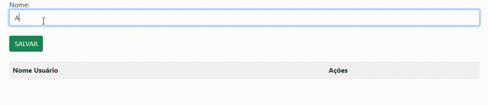
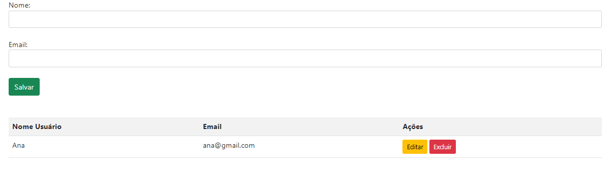

# Projeto de validação de e-mail e CPF com JavaScript 

## Índice
* [Introdução](#introdução)
* [Funcionalidades](#funcionalidades)
* [Lógica do código](#lógica-do-código)
* [Recursos de JavaScript utilizados](#recursos-de-javascript-utilizados)
* [Melhorias feitas](#melhorias-feitas)
* [Técnicas e tecnologias utilizadas](#técnicas-e-tecnologias-utilizadas)
* [Fontes Consultadas](#fontes-consultadas)


## Introdução
1. Este repositório contém o código fonte de uma aplicação web simples para gerenciar uma lista de usuários. A aplicação oferece as seguintes funcionalidades:

    - **Formulário de cadastro:** Um formulário intuitivo para adicionar novos usuários por nome e e-mail.
    - **Tabela de usuários:** Uma tabela HTML dinâmica que lista todos os usuários cadastrados por nome e e-mail permitindo a visualização rápida dos dados.

2. Funcionalidades técnicas:
    - **JavaScript:** A lógica da aplicação é implementada em JavaScript puro, manipulando o DOM para criar e atualizar a interface do usuário.
    - **Armazenamento de dados:** Os dados dos usuários são armazenados em um array JavaScript, o que é útil para demonstração, mas não é recomendado para aplicações em produção.

<br>

### Tela de Login
    A tela de login permite que usuários autenticados acessem o sistema. O usuário deve fornecer um email válido e uma senha correspondente para realizar o login.


- **Funcionalidades básicas:**
    - **Validação:** Verifica se os campos de email e senha estão preenchidos.
    - **Redirecionamento:** Redireciona para a página de cadastro caso os campos estejam vazios.

### Tela de Cadastro 
    A tela de cadastro permite que novos usuários se registrem no sistema. O usuário deve fornecer um nome e e-mail para criar sua conta.



- **Funcionalidades básicas:**
    - **Cadastro:** Adiciona o nome do usuário a uma lista em memória.
    - **Visualização:** Exibe os usuários cadastrados em uma tabela.
    - **Edição:** Permite editar o nome de um usuário.
    - **Exclusão:** Permite excluir um usuário da lista

## Funcionalidades
### function acessar()

````
- Obtenção dos valores: Captura os valores dos campos de email e senha do formulário de login.
- Validação: Verifica se ambos os campos estão preenchidos.
- Redirecionamento: Se os campos estiverem válidos, redireciona para a página de cadastro. 
````
<br>

### function salvarUser()

````
- Obtenção do valor: Captura o nome do usuário do campo de entrada.
- Validação: Verifica se o campo de nome está preenchido.
- Adição ao array: Adiciona o nome do usuário ao array dadosLista.
- Atualização da tabela: Chama a função criarLista() para atualizar a tabela na tela.
- Limpeza do campo: Limpa o campo de entrada de nome para o próximo usuário.`
````
<br>

### function criarLista()

````
- Criação da tabela: Cria a estrutura básica da tabela HTML com um cabeçalho contendo as colunas "Nome Usuário" e "Ações".
- Preenchimento da tabela: Percorre o array dadosLista e para cada usuário:
- Cria uma nova linha na tabela.
- Adiciona uma célula com o nome do usuário.
- Adiciona uma célula com dois botões: um para editar e outro para excluir o usuário. Os botões chamam as funções editar() e excluir(), respectivamente.
````
<br>

### function excluir(i)

````
- Remoção do array: Remove o elemento na posição i do array dadosLista.
- Remoção da linha: Remove a linha correspondente na tabela HTML.
````
<br>

### function editar(i)

````
- Preenchimento do campo: Preenche o campo de entrada de nome com o nome do usuário a ser editado.
- Remoção do item: Remove o item antigo do array dadosLista. 
````
<br>

## Lógica do código
    O código funciona como um pequeno banco de dados em memória, armazenando os nomes dos usuários em um array. A interface HTML é atualizada dinamicamente sempre que um novo usuário é adicionado, editado ou excluído.


## Recursos de JavaScript utilizados 
### Manipulação do DOM (Document Object Model)
`````
- document.getElementById(): Essa função é usada para selecionar elementos HTML pelo seu ID. No código, ela é utilizada para obter os elementos de input (email, senha, nome) e a tabela onde os usuários são listados.
- innerHTML: Essa propriedade é usada para modificar o conteúdo HTML de um elemento. No caso da tabela, ela é utilizada para criar as linhas e colunas dinamicamente.
- createElement(): Embora não seja explicitamente usada neste código, essa função permite criar novos elementos HTML programaticamente.
- appendChild(): Outra função para manipulação do DOM, permite adicionar um nó filho a um elemento pai.
`````
<br>

### Trabalhando com Arrays
````
- dadosLista: Um array simples é usado para armazenar os nomes dos usuários.
- push(): Adiciona um novo elemento ao final do array.
- splice(): Remove elementos de um array a partir de um índice específico.
````
<br>

### Eventos
````
- onclick: Esse atributo é usado para associar uma função a um evento de clique. Nos botões de "Editar" e "Excluir", ele chama as funções editar() e excluir(), respectivamente.
````
<br>

### Funções
````
- Funções anônimas: São usadas para definir o comportamento dos botões de "Editar" e "Excluir" diretamente no atributo onclick.
- window.location.href: Redireciona o navegador para uma nova URL.
````
<br>

### Outras características
````
- Variáveis: O código utiliza variáveis para armazenar valores temporários, como o nome do usuário e o índice do elemento a ser editado ou excluído.
- Condicionais: As estruturas if são usadas para tomar decisões, como verificar se os campos estão preenchidos.
- Laços: O laço for é usado para percorrer o array dadosLista e criar as linhas da tabela.
````
# Adição de e-mail ao cadastro de usuário

<br>

## Melhorias feitas 
### function salvarUser()

````
- Obtenção do valor: Captura o e-mail e nome do usuário do campo de entrada.
- Validação: Verifica se o campo de nome e e-mail estão preenchidos, e se o e-mail colocado é realmente um e-mail.
- Adição ao array: Adiciona o nome e e-mail do usuário ao array dadosLista.
- Atualização da tabela: Chama a função criarLista() para atualizar a tabela na tela.
- Limpeza do campo: Limpa o campo de entrada de nome para o próximo usuário.`
````
<br>

### function criarLista()

````
- Criação da tabela: Cria a estrutura básica da tabela HTML com um cabeçalho contendo as colunas "Nome Usuário", "E-mail" e "Ações".
- Preenchimento da tabela: Percorre o array dadosLista e para cada usuário:
- Cria uma nova linha na tabela.
- Adiciona uma célula com o nome do usuário.
- Adiciona uma célula com o e-mail do usuário. 
- Adiciona uma célula com dois botões: um para editar e outro para excluir o nome e e-mail do usuário. Os botões chamam as funções editar() e excluir(), respectivamente.
````
<br>

### function excluir(i)

````
- Remoção do array: Remove o elemento na posição i do array dadosLista.
- Remoção da linha: Remove a linha correspondente na tabela HTML.
````
<br>

### function editar(i)

````
- Preenchimento do campo: Preenche o campo de entrada de nome ou e-mail com o nome ou e-mail do usuário a ser editado.
- Remoção do item: Remove o item antigo do array dadosLista. 
````
<br>


## Técnicas e tecnologias utilizadas
* [<code></code>](https://developer.mozilla.org/pt-BR/docs/Web/HTML)
* [<code></code>](https://developer.mozilla.org/pt-BR/docs/Web/CSS)
* [<code></code>](https://developer.mozilla.org/pt-BR/docs/Web/JavaScript)
* [<code></code>](https://git-scm.com/)
* [<code></code>](https://bard.google.com/chat?hl=pt)
* [<code></code>](https://code.visualstudio.com/)
* [<code></code>](https://github.com/)


## Fontes consultadas 
* [Alura - Como escrever um bom README.md](https://www.alura.com.br/artigos/escrever-bom-readme)
* [Bootstrap](https://getbootstrap.com/docs/5.3/forms/checks-radios/#radios)
* [Alura - Tipos de type](https://cursos.alura.com.br/forum/topico-type-do-campo-telefone-104370)
* [Dio](https://www.dio.me/articles/tutorial-criando-um-readme-bonitao-para-o-seu-github)
* [Progamador alternativo - Youtube](https://youtu.be/HJ16WEmOWTw?si=UFvCAtBHbuCc08Hu)
* [Fotos para o subtópico "Técnicas e tecnologias consultadas"](https://github.com/alexandresanlim/Badges4-README.md-Profile)
* [HomeHost](https://www.homehost.com.br/blog/tutoriais/html-buttton/)
* [W3schools](https://www.w3schools.com/js/js_window_location.asp)
* [Site de animações para css](https://storyset.com/search)
* [Paleta de cores para html](https://paletadecolores.online/pt/azul/indigo/)
* [Conversor de MP4 para Gif](https://cloudconvert.com/)
* [Gif divisor de texto](https://steemit.com/pt/@coyotelation/20-divisores-de-texto-em-gif-apenas-copie-e-cole-confira)


## Autor(a)
|  [<br><sub>Ana Santos</sub>](https://github.com/AnaLu1za) |  
| :---: |

[<code></code>](https://www.linkedin.com/in/ana-luiza-santos-a5032a2a2/)